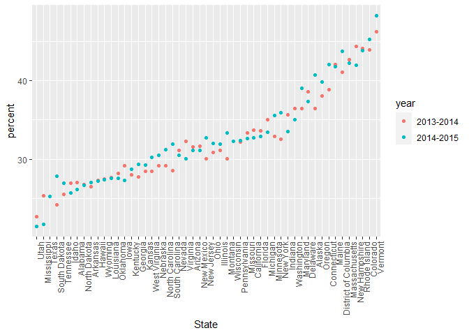
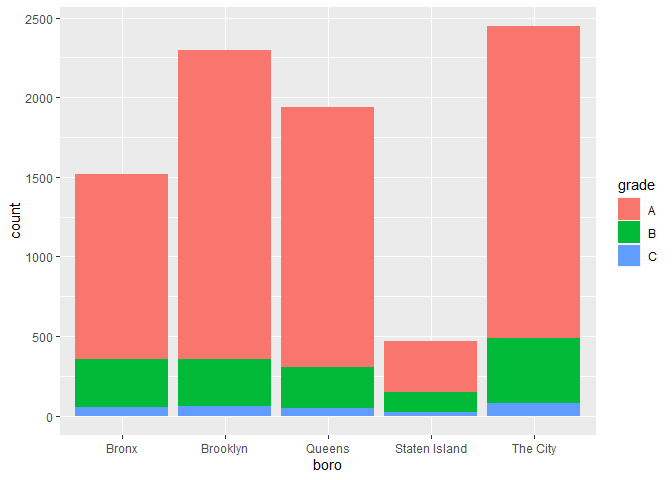
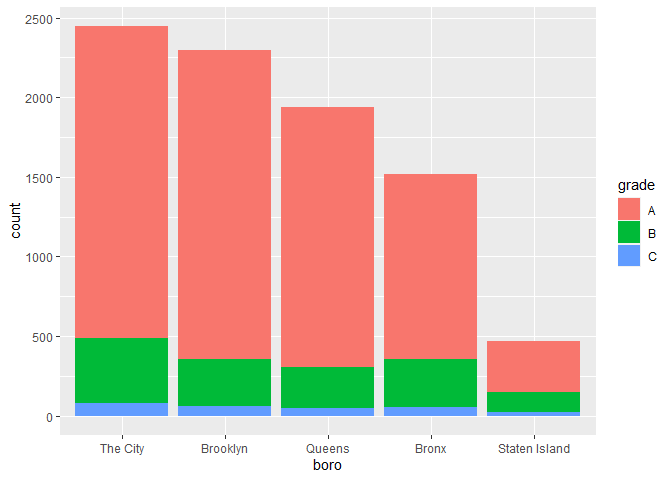

Strings and factors
================
Lucia Wang (lw3061)
2023-10-17

## Strings and regular expressions!

``` r
library(rvest)
library(p8105.datasets)
library(tidyverse)
```

    ## ── Attaching core tidyverse packages ──────────────────────── tidyverse 2.0.0 ──
    ## ✔ dplyr     1.1.3     ✔ readr     2.1.4
    ## ✔ forcats   1.0.0     ✔ stringr   1.5.0
    ## ✔ ggplot2   3.4.3     ✔ tibble    3.2.1
    ## ✔ lubridate 1.9.2     ✔ tidyr     1.3.0
    ## ✔ purrr     1.0.2     
    ## ── Conflicts ────────────────────────────────────────── tidyverse_conflicts() ──
    ## ✖ dplyr::filter()         masks stats::filter()
    ## ✖ readr::guess_encoding() masks rvest::guess_encoding()
    ## ✖ dplyr::lag()            masks stats::lag()
    ## ℹ Use the conflicted package (<http://conflicted.r-lib.org/>) to force all conflicts to become errors

``` r
string_vec = c("my", "name", "is", "jeff")

str_detect(string_vec, "e") #in 'name' and 'jeff'
```

    ## [1] FALSE  TRUE FALSE  TRUE

``` r
str_detect(string_vec, "Jeff") #not there bc of case
```

    ## [1] FALSE FALSE FALSE FALSE

``` r
str_detect(string_vec, "jeff")
```

    ## [1] FALSE FALSE FALSE  TRUE

``` r
str_replace(string_vec, "jeff", "Jeff")
```

    ## [1] "my"   "name" "is"   "Jeff"

``` r
string_vec = c(
  "i think we all rule for participating",
  "i think i have been caught",
  "i think this will be quite fun actually",
  "it will be fun, i think"
  )

str_detect(string_vec, "^i think")
```

    ## [1]  TRUE  TRUE  TRUE FALSE

``` r
# can differentiate between at the beginning vs at the end. ^ is beginning

str_detect(string_vec, "i think$")
```

    ## [1] FALSE FALSE FALSE  TRUE

``` r
# $ at the end
```

``` r
string_vec = c(
  "Time for a Pumpkin Spice Latte!",
  "went to the #pumpkinpatch last weekend",
  "Pumpkin Pie is obviously the best pie",
  "SMASHING PUMPKINS -- LIVE IN CONCERT!!"
  )

str_detect(string_vec,"[Pp]umpkin")
```

    ## [1]  TRUE  TRUE  TRUE FALSE

``` r
# everything in brackets can be matched
```

``` r
string_vec = c(
  '7th inning stretch',
  '1st half soon to begin. Texas won the toss.',
  'she is 5 feet 4 inches tall',
  '3AM - cant sleep :('
  )

str_detect(string_vec, "^[0-9][a-z]")
```

    ## [1]  TRUE  TRUE FALSE FALSE

``` r
# at the beginning, want to look for a number followed by lowercase letter. spaces count as a character!!
```

``` r
string_vec = c(
  'Its 7:11 in the evening',
  'want to go to 7-11?',
  'my flight is AA711',
  'NetBios: scanning ip 203.167.114.66'
  )

str_detect(string_vec, "7.11")
```

    ## [1]  TRUE  TRUE FALSE  TRUE

``` r
# the . (period) stands for ANY character
```

what if you want to detect special characters? you have to designate it
with a backslash… which is also a special character

``` r
string_vec = c(
  'The CI is [2, 5]',
  ':-]',
  ':-[',
  'I found the answer on pages [6-7]'
  )

str_detect(string_vec, "\\[")
```

    ## [1]  TRUE FALSE  TRUE  TRUE

``` r
# first backslash for detecting the second backslash for detecting the square bracket
```

dont use special characters in data bc it makes regular expressions
difficult

## factors

``` r
vec_sex = factor(c("male", "male", "female", "female"))
vec_sex
```

    ## [1] male   male   female female
    ## Levels: female male

``` r
as.numeric(vec_sex)
```

    ## [1] 2 2 1 1

``` r
vec_sex = fct_relevel(vec_sex, "male") # reorders 
vec_sex
```

    ## [1] male   male   female female
    ## Levels: male female

``` r
as.numeric(vec_sex) # now the levels are different... can be confusing
```

    ## [1] 1 1 2 2

## NSDUH

``` r
nsduh_url = "http://samhda.s3-us-gov-west-1.amazonaws.com/s3fs-public/field-uploads/2k15StateFiles/NSDUHsaeShortTermCHG2015.htm"

table_marj = 
  read_html(nsduh_url) |> 
  html_table() |> 
  first() |>
  slice(-1) # we need to tidy
```

``` r
marj_df = table_marj |>
  select(-contains("P Value")) |>
  pivot_longer(
    -State,
    names_to = "age_year",
    values_to = "percent"
  ) |>
  separate(age_year, into=c("age", "year"), sep="\\(") |>
  mutate(
    year = str_replace(year, "\\)", ""),
         percent = str_replace(percent, "[a-b]", ""),
      percent = as.numeric(percent)
    ) |>
  filter(!(State %in% c("Total U.S.", "Northeast", "Midwest", "South", "West")))
```

``` r
marj_df |>
  filter(age == "18-25") |>
  mutate(State = fct_reorder(State, percent)) |>
  ggplot(aes(x=State, y=percent, color= year)) +
  geom_point() +
  theme(axis.text.x = element_text(angle = 90, hjust = 1))
```

<!-- -->

## NYC restaurant inspections

``` r
data("rest_inspec")

rest_inspec |> 
  count(boro, grade) |>
  pivot_wider(
    names_from = grade,
    values_from = n
  ) |> knitr::kable()
```

| boro          |     A |     B |    C | Not Yet Graded |   P |    Z |    NA |
|:--------------|------:|------:|-----:|---------------:|----:|-----:|------:|
| BRONX         | 13688 |  2801 |  701 |            200 | 163 |  351 | 16833 |
| BROOKLYN      | 37449 |  6651 | 1684 |            702 | 416 |  977 | 51930 |
| MANHATTAN     | 61608 | 10532 | 2689 |            765 | 508 | 1237 | 80615 |
| Missing       |     4 |    NA |   NA |             NA |  NA |   NA |    13 |
| QUEENS        | 35952 |  6492 | 1593 |            604 | 331 |  913 | 45816 |
| STATEN ISLAND |  5215 |   933 |  207 |             85 |  47 |  149 |  6730 |

``` r
inspection_df = rest_inspec |>
  filter(grade %in% c("A", "B", "C"), boro != "Missing") |>
  mutate(boro = str_to_title(boro))

inspection_df |>
  filter(str_detect(dba, "Pizza")) |>
  count(boro)
```

    ## # A tibble: 5 × 2
    ##   boro              n
    ##   <chr>         <int>
    ## 1 Bronx            12
    ## 2 Brooklyn          6
    ## 3 Manhattan        34
    ## 4 Queens           17
    ## 5 Staten Island     5

``` r
inspection_df |>
  filter(str_detect(dba, "PIZZA")) |>
  mutate(boro = fct_infreq(boro)) |> 
  ggplot(aes(x=boro, fill=grade)) +
  geom_bar()
```

<!-- -->

``` r
inspection_df |>
  filter(str_detect(dba, "PIZZA")) |>
  mutate(boro = fct_infreq(boro),
         boro = str_replace(boro, "Manhattan", "The City")) |> 
  ggplot(aes(x=boro, fill=grade)) +
  geom_bar() #breaks the order bc no longer factors...
```

<!-- -->

`fct_infreq` from most to least common (frequency order). use recode
instead of renaming for factors

``` r
inspection_df |>
  filter(str_detect(dba, "PIZZA")) |>
  mutate(boro = fct_infreq(boro),
         boro = fct_recode(boro, "The City" = "Manhattan")) |> 
  ggplot(aes(x=boro, fill=grade)) +
  geom_bar()
```

<!-- -->
